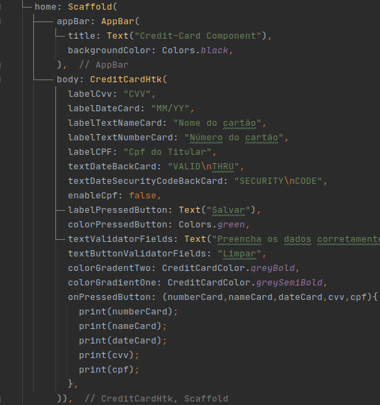

Componente de Cartão de Crédito 💳
====

 
   Componente customizavel de cartão de crédito, fornece uma serie de recursos para melhorar a apresentação visual do componente e possui uma serie de regras aplicadas ao número do cartão de crédito. O componente sabe diferenciar os cartões de acordo com a sua bandeira e possui flexibidade para alteração de configurações.      

## Table of content
- [Iniciando...]
- [Como Usar]
- [Estrutura de Modulos]
- [GIFS]

## Iniciando...
Faça uma copia do projeto e em seguida localize o arquivo main.dart, localize o widget CreditCardHtk ele ja esta com uma configuração default; Execute o projeto;

### Como Usar o Widget;

Para utilizar o CreditCardHtk você deve criar uma instancia do mesmo dentro de um Scaffold - sim, internamente é utilizado o Scaffold para exibir algumas mensagens customizaveis.

* As propriedades do tipo label são placeholders para as caixas de texto. Algumas são requeridas inicialmente e outras não!
* As propriedades de cores definem as cores do cartão de credito em forma de gradiente - caso não seja especificado o componente irá utilizar as cores embutidas.
* As propriedade de Cpf booleana define se é necessario exibir uma caixa de texto para o CPF (todas as mascaras ja estão nas caixas de texto)
* A propriedade onPressedButton retorna os valores de cada campo digitado;
* Existem algumas propriedades que não são requeridas para o uso basico do componente, porem voce pode querer utiliza-las se quiser ainda mais customização.
* O componente ja faz validações quanto ao conteudo dos campos digitados;

* Logo abaixo segue a estrutura de modulos do componente - fique a vontade para customizar a sua vontade ;] 
### Estrutura de Modulos

### GIFS

